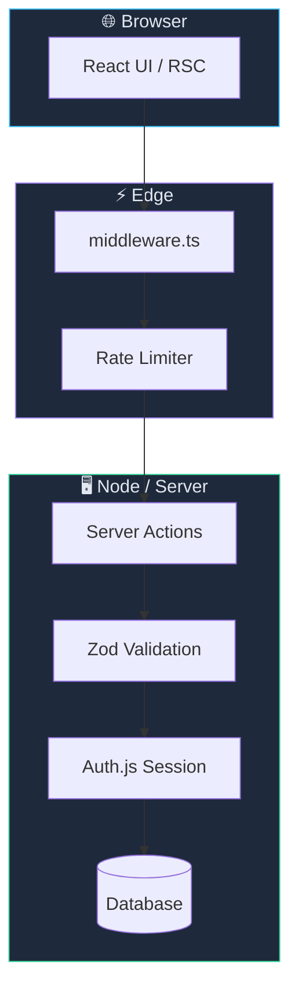

<div align="center">

# 🛡️ Next.js Enterprise Security Shield

**Production-ready security patterns, checklists, and curated resources for Next.js (App Router) applications.**

[](https://nextjs.org/)
[](https://react.dev/)
[](https://www.typescriptlang.org/)
[](https://owasp.org/www-project-top-ten/)
[](./LICENSE)

[](https://github.com/daker52/Next.js---Security-shield-list-help/stargazers)
[](https://github.com/daker52/Next.js---Security-shield-list-help/network/members)
[](https://github.com/daker52/Next.js---Security-shield-list-help/issues)

[Features](#-core-security-features) ·
[Structure](#-recommended-project-structure) ·
[Snippets](#-implementation-snippets) ·
[Getting Started](#-getting-started) ·
[Resources](#-essential-security-resources) ·
[Checklist](#-security-audit-checklist) ·
[Author](#-about-the-author)

</div>

---

> **Security is not a feature — it is the foundation.**  
> This repository distills **10+ years** of freelance engineering experience into a **bulletproof starting point** for Next.js projects: OWASP Top 10 coverage, App Router specifics, Server Actions hardening, and a hand-picked library of canonical guides.

<table>
<tr>
<td width="50%">

### 🎯 What you get

- Hardened **HTTP security headers** (CSP, HSTS, framing)
- **Server Actions** threat model & mitigations
- **Zod** validation patterns for every boundary
- **Auth.js** session & cookie best practices
- **Edge rate limiting** (Upstash / Redis)
- **Dependency auditing** workflow
- **React Taint** APIs for secret leakage prevention

</td>
<td width="50%">

### 📌 Repository status

| Area | Status |
|------|--------|
| Security guide & checklist | ✅ Ready |
| Curated resource links | ✅ Ready |
| Reference code snippets | ✅ Ready |
| Full boilerplate scaffold | ✅ Ready |

> Clone, `npm ci`, copy `.env.example` → `.env.local`, then `npm run dev`.

</td>
</tr>
</table>

---

## 📑 Table of Contents

1. [Core Security Features](#-core-security-features)
2. [Recommended Project Structure](#-recommended-project-structure)
3. [Implementation Snippets](#-implementation-snippets)
4. [Getting Started](#-getting-started)
5. [Essential Security Resources](#-essential-security-resources)
6. [Security Audit Checklist](#-security-audit-checklist)
7. [About the Author](#-about-the-author)
8. [License](#-license)

---

## 🔒 Core Security Features

| Layer | Protection | Tooling |
|-------|------------|---------|
| **Transport** | HSTS, HTTPS-only cookies | `next.config.js`, hosting TLS |
| **Browser** | CSP, `X-Frame-Options`, `nosniff` | Security headers middleware |
| **Application** | Input validation, authz checks | [Zod](https://zod.dev/), Server Actions guards |
| **Session** | HTTP-only, `SameSite`, rotation | [Auth.js](https://authjs.dev/) |
| **API / Edge** | Rate limits, bot mitigation | [Upstash](https://upstash.com/) Redis |
| **Supply chain** | Vulnerable dependency alerts | Dependabot, `npm audit`, Snyk |
| **Data boundary** | Prevent server secret leaks | React [Taint APIs](https://react.dev/reference/rsc/taint) |

<details>
<summary><strong>📖 Expand — feature deep dive</strong></summary>

<br>

- **Advanced HTTP Security Headers** — Strict CSP, HSTS, `X-Frame-Options`, and more in `next.config.js` or Edge middleware.
- **Server Actions Protection** — Treat actions as public endpoints; validate inputs, check auth, avoid closure leaks ([Next.js security blog](https://nextjs.org/blog/security-nextjs)).
- **Strict Input/Output Validation** — Runtime schemas with Zod on every external boundary (forms, webhooks, actions).
- **Authentication & Sessions** — Secure HTTP-only, `SameSite` cookies; short-lived JWTs or database sessions via Auth.js.
- **Rate Limiting & DDoS Mitigation** — Edge-ready throttling with Upstash/Redis on login and expensive routes.
- **Dependency Auditing** — Automated CVE scanning (Dependabot / Snyk + `npm audit` in CI).
- **Data Tainting** — React experimental taint APIs to block passwords, tokens, and connection strings from the client bundle.

</details>

---

## 📂 Recommended Project Structure

A well-organized codebase is the first line of defense against accidental data leaks.

```text
├── src/
│   ├── app/                    # Next.js App Router (UI & routing)
│   ├── lib/
│   │   ├── auth/               # Auth.js config & OAuth providers
│   │   ├── db/                 # DB client & parameterized queries
│   │   └── security/           # Rate limits, encryption, sanitizers
│   ├── server/
│   │   ├── actions/            # Server Actions (always validated)
│   │   └── validations/        # Zod schemas for all external inputs
│   └── middleware.ts           # Edge middleware — auth & security routing
├── .env.example                # Safe env template (never commit secrets)
├── next.config.ts              # Security headers & experimental flags
└── scripts/
    └── check-security.sh       # Pre-commit / CI vulnerability scan
```



---

## 💻 Implementation Snippets

### Security headers (`next.config.ts`)

Enforce a strict **Content Security Policy (CSP)** by default to reduce XSS risk:

```typescript
// next.config.ts
import type { NextConfig } from "next";

const securityHeaders = [
  {
    key: "Content-Security-Policy",
    value: [
      "default-src 'self'",
      "script-src 'self'",
      "style-src 'self' 'unsafe-inline'",
      "img-src 'self' data: https:",
      "font-src 'self' data:",
      "frame-ancestors 'none'",
      "base-uri 'self'",
      "form-action 'self'",
    ].join("; "),
  },
  { key: "X-Frame-Options", value: "DENY" },
  { key: "X-Content-Type-Options", value: "nosniff" },
  { key: "Referrer-Policy", value: "strict-origin-when-cross-origin" },
  {
    key: "Strict-Transport-Security",
    value: "max-age=63072000; includeSubDomains; preload",
  },
  {
    key: "Permissions-Policy",
    value: "camera=(), microphone=(), geolocation=()",
  },
];

const nextConfig: NextConfig = {
  async headers() {
    return [{ source: "/(.*)", headers: securityHeaders }];
  },
};

export default nextConfig;
```

> **Tip:** Validate your live deployment at [securityheaders.com](https://securityheaders.com/) and tighten CSP incrementally (remove `'unsafe-inline'` when possible).

### Server Action guard pattern

```typescript
"use server";

import { z } from "zod";
import { auth } from "@/lib/auth";

const updateProfileSchema = z.object({
  displayName: z.string().min(1).max(64),
});

export async function updateProfile(formData: FormData) {
  const session = await auth();
  if (!session?.user?.id) throw new Error("Unauthorized");

  const parsed = updateProfileSchema.safeParse({
    displayName: formData.get("displayName"),
  });

  if (!parsed.success) throw new Error("Invalid input");

  // ... persist with parameterized queries only
}
```

---

## 🚀 Getting Started

### 1. Clone this repository

```bash
git clone https://github.com/daker52/Next.js---Security-shield-list-help.git
cd Next.js---Security-shield-list-help
```

### 2. Use it as a security blueprint

| Step | Action |
|------|--------|
| 📋 | Copy the [audit checklist](#-security-audit-checklist) into your project wiki |
| 📚 | Work through the [resource links](#-essential-security-resources) |
| 🏗️ | Scaffold your app using the [folder structure](#-recommended-project-structure) |
| 🔧 | Paste & adapt the [header snippet](#security-headers-nextconfigts) |

### 3. Configure environment

```bash
cp .env.example .env.local
# Generate AUTH_SECRET (required for production):
openssl rand -base64 32
```

Paste the output into `.env.local` as `AUTH_SECRET=...`

### 4. Run locally

```bash
npm run dev
# → http://localhost:3000
# Register → /register → Sign in → /dashboard
```

### 5. Security scripts

```bash
npm run security:audit   # npm audit (moderate+)
npm run security:check   # headers, env leaks, .gitignore (bash)
```

### 4. Environment variables — rules of thumb

| ✅ Do | ❌ Don't |
|-------|---------|
| Store secrets in `.env.local` (gitignored) | Commit `.env` with real keys |
| Use `AUTH_SECRET` / server-only vars | Prefix secrets with `NEXT_PUBLIC_` |
| Rotate keys after leaks | Reuse dev secrets in production |

---

## 📚 Essential Security Resources

Hand-picked, high-signal references — the same stack used on real freelance engagements.

### ⚛️ Next.js & React

| Resource | Why it matters | Link |
|----------|----------------|------|
| **Next.js — Security** | Official threat model: middleware, headers, Server Actions, CSRF | [nextjs.org/blog/security-nextjs](https://nextjs.org/blog/security-nextjs) |
| **Next.js — CSP Guide** | Step-by-step Content Security Policy for App Router | [nextjs.org/docs/app/building-your-application/configuring/content-security-policy](https://nextjs.org/docs/app/building-your-application/configuring/content-security-policy) |
| **React — Taint APIs** | Block sensitive server objects from client bundles | [react.dev/reference/rsc/taint](https://react.dev/reference/rsc/taint) |
| **React — XSS & escaping** | When auto-escaping fails (`dangerouslySetInnerHTML`) | [react.dev/learn/escape-hatches](https://react.dev/learn/escape-hatches) |
| **Auth.js (NextAuth v5)** | Sessions, OAuth, JWT vs database strategies | [authjs.dev](https://authjs.dev/) |
| **Vercel — Server Actions** | Actions as public endpoints — validation required | [nextjs.org/docs/app/building-your-application/data-fetching/server-actions-and-mutations](https://nextjs.org/docs/app/building-your-application/data-fetching/server-actions-and-mutations) |

### 🌐 General web security

| Resource | Focus | Link |
|----------|-------|------|
| **OWASP Top 10 (2021)** | Industry-standard vulnerability taxonomy | [owasp.org/www-project-top-ten](https://owasp.org/www-project-top-ten/) |
| **MDN — Web Security** | CORS, CSP, cookies, HTTPS fundamentals | [developer.mozilla.org/Web/Security](https://developer.mozilla.org/en-US/docs/Web/Security) |
| **Zod** | Runtime validation — injection & malformed payload defense | [zod.dev](https://zod.dev/) |
| **Prisma — Security** | ORM safety, raw query parameterization | [prisma.io/docs/guides/security](https://www.prisma.io/docs/guides/security) |
| **OWASP Cheat Sheet Series** | Quick-reference hardening guides | [cheatsheetseries.owasp.org](https://cheatsheetseries.owasp.org/) |

### 📡 Continuous learning & threat intelligence

| Resource | Focus | Link |
|----------|-------|------|
| **Web Almanac — Security** | Empirical data on header adoption & trends | [almanac.httparchive.org/en/2024/security](https://almanac.httparchive.org/en/2024/security) |
| **GitHub Security Blog** | Supply-chain & platform security updates | [github.blog/tag/security](https://github.blog/tag/security/) |
| **CISA Known Exploited Vulnerabilities** | Actively exploited CVEs to patch first | [cisa.gov/known-exploited-vulnerabilities-catalog](https://www.cisa.gov/known-exploited-vulnerabilities-catalog) |
| **npm audit docs** | Built-in dependency vulnerability scanning | [docs.npmjs.com/cli/v10/commands/npm-audit](https://docs.npmjs.com/cli/v10/commands/npm-audit) |

### 🔍 Quick verification tools

| Tool | Use case | Link |
|------|----------|------|
| **SecurityHeaders.com** | Grade live HTTP response headers | [securityheaders.com](https://securityheaders.com/) |
| **Mozilla Observatory** | Full-site security scan | [observatory.mozilla.org](https://observatory.mozilla.org/) |
| **SSL Labs** | TLS configuration test | [ssllabs.com/ssltest](https://www.ssllabs.com/ssltest/) |

---

## 🛡️ Security Audit Checklist

Copy this into your PR template or runbook before every production deploy.

- [ ] **Dependencies** — `npm audit` / Dependabot: zero critical CVEs?
- [ ] **Headers** — CSP, HSTS, framing tested on [SecurityHeaders.com](https://securityheaders.com/)?
- [ ] **Secrets** — No sensitive values under `NEXT_PUBLIC_*`?
- [ ] **Validation** — Every Server Action & API route validated with Zod (or equivalent)?
- [ ] **Auth** — CSRF protection enabled; sessions HTTP-only + `SameSite`; JWTs short-lived?
- [ ] **Authorization** — Access control checked server-side on every mutation?
- [ ] **Rate limiting** — Login, signup, and expensive routes throttled?
- [ ] **Logging** — No passwords/tokens in logs; PII minimized?
- [ ] **Error handling** — Generic errors to clients; details only server-side?
- [ ] **Backups & rollback** — Deployment can be reverted in &lt; 15 minutes?

---

## 👨‍💻 About the Author

**OndHa** — Senior Software Engineer & Tech Consultant with **10+ years** of experience helping startups and enterprises ship **scalable, secure** web applications. Open-source advocate · security-by-design · clean architecture.

<div align="center">

[](https://github.com/daker52)
[](https://wwwkkcode.cz)
[](https://github.com/daker52/Next.js---Security-shield-list-help)

</div>

### 💼 Need a security review?

Your Next.js app needs a **security audit**, **performance tuning**, or **architecture review**? Let's connect — reach out via [GitHub Issues](https://github.com/daker52/Next.js---Security-shield-list-help/issues) or [wwwkkcode.cz](https://wwwkkcode.cz).

---

## 📝 License

Distributed under the **MIT License**. See [LICENSE](./LICENSE) for details.

---

<div align="center">

**If this guide saved you a production incident, consider giving it a ⭐**

<sub>Built with ❤️ for the Next.js community · May 2026</sub>

</div>
